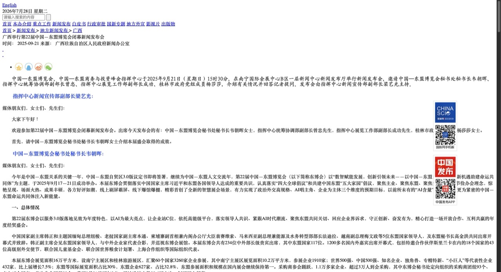
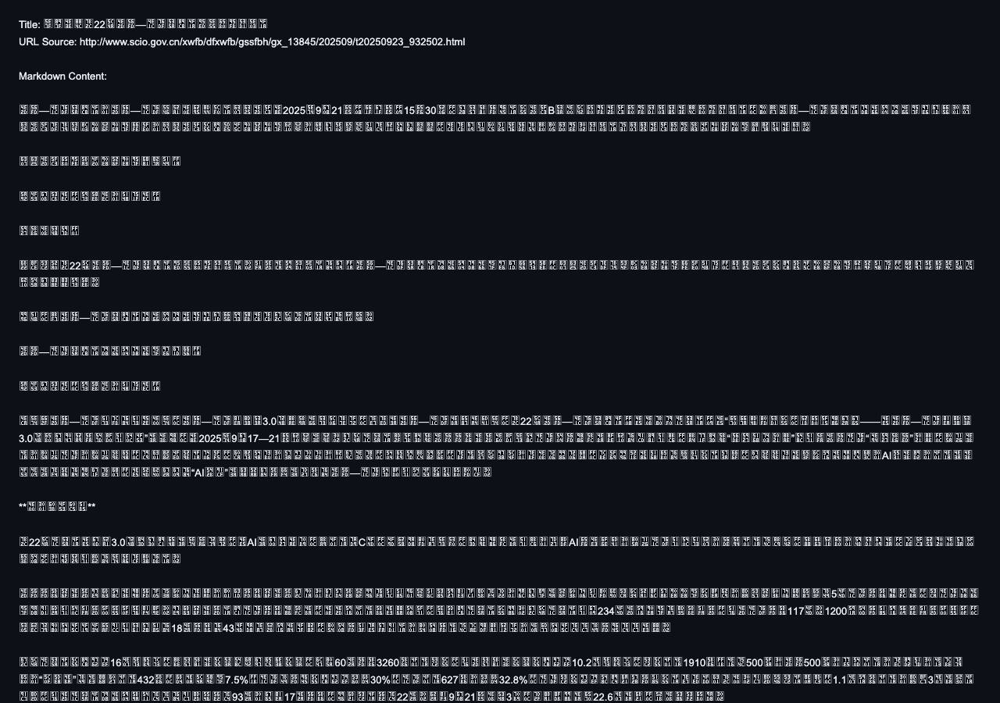

# web2md

**English** | [简体中文](./README.zh-CN.md)

A lightweight, self-hosted [r.jina.ai](https://r.jina.ai) style reader service.
Prepend the service prefix to any URL and get the page back as clean, AI-ready
Markdown — from static pages and JS-rendered SPAs alike (WeChat
official-account articles included).

| Original webpage | Converted Markdown output |
| --- | --- |
|  |  |

## Features

- **Prefix-based usage, just like r.jina.ai** — `http://localhost:3000/<url>` → `text/markdown`
- **Static pages, sub-second** — Mozilla Readability extraction + Turndown conversion
- **SPA / JS-rendered pages** — automatic fallback to a real headless browser ([Camoufox](https://github.com/daijro/camoufox), an anti-detect Firefox build)
- **WAF bypass** — solves the Knownsec/yunaq `__jsl_clearance` JavaScript challenge (common on Chinese government sites) in a sandboxed VM; cookies cached per host
- **Encoding-safe** — jsdom sniffs the charset, so GBK and UTF-8 pages both decode correctly
- **Docker Compose deployment** — one command, everything included

## Project structure

```
├── src/
│   ├── server.ts        # HTTP service: fetch, WAF solver, extraction, SPA fallback
│   └── render.py        # Camoufox (headless Firefox) renderer for JS pages
├── test/
│   └── smoke-test.ts    # end-to-end smoke test (npm test)
├── docs/images/         # README illustrations
├── Dockerfile           # all-in-one image: Node 22 + Python + Camoufox browser
├── docker-compose.yml
├── tsconfig.json
├── package.json
└── start.command        # macOS double-click launcher
```

## Quick start (local)

```bash
npm install
npm start          # compiles TypeScript, then listens on http://localhost:3000
```

`npm start` always runs the TypeScript build first (`prestart` hook), so the
code you edit is the code you run. To build without starting: `npm run build`.
Set `PORT` to change the listening port.

**macOS shortcut:** double-click `start.command` in Finder — it opens a
Terminal window and runs `npm start` for you (already committed with the
executable bit, so it just works).

Static pages work out of the box. For JS-rendered pages (React/Vue SPAs),
install the Camoufox browser fallback:

```bash
python3 -m venv .venv
.venv/bin/pip install camoufox
.venv/bin/python -m camoufox fetch   # downloads the browser to ~/Library/Caches/camoufox
```

No configuration needed — when static extraction comes back empty or looks
like a JS shell, the service automatically renders the page in headless
Firefox. Without `.venv`, everything still works for static pages.

## Deploy with Docker Compose

Everything (Node 22 + Python venv + Camoufox browser + Firefox system
libraries) is baked into one image — including the TypeScript build:

```bash
docker compose up -d --build   # first build downloads ~500MB (browser included)
curl http://localhost:3000/example.com
docker compose logs -f         # watch requests
docker compose down            # stop
```

Change the port mapping in `docker-compose.yml` (`"8080:3000"` to serve on
port 8080); `PORT` inside the container stays 3000.

### Server requirements (VPS)

| Spec | Minimum | Recommended |
| --- | --- | --- |
| CPU | 1 vCPU | 2 vCPU |
| RAM | 1 GB | 2 GB (4 GB if SPA renders are frequent) |
| Disk | 10 GB | 20 GB |

The static path is cheap — the heavy part is the headless-Firefox fallback.
Each SPA render spawns a fresh browser (~200MB RAM and a full CPU core while
rendering), and the container's shared memory is sized at 512MB. On a 1GB
machine, add swap so concurrent renders don't OOM; the built image takes ~2GB
on disk.

## Usage

**The whole API is one rule: put the target URL after the prefix.**

```
http://localhost:3000/https://example.com/article
http://localhost:3000/http://example.com/article
http://localhost:3000/example.com/article        (https is assumed)
```

Convert a page and save it as a Markdown file:

```bash
curl -o article.md "http://localhost:3000/http://www.scio.gov.cn/xwfb/dfxwfb/gssfbh/gx_13845/202509/t20250923_932502.html"
```

The response is `text/markdown` with a small header followed by the content:

```
Title: 广西举行第22届中国—东盟博览会闭幕新闻发布会
URL Source: http://www.scio.gov.cn/...

Markdown Content:

中国—东盟博览会、中国—东盟商务与投资峰会指挥中心于2025年9月21日...
```

What to expect for different kinds of pages:

- **Static pages** (news, blogs, docs, government bulletins, WeChat
  official-account articles): returned in well under a second.
- **Pages behind the Knownsec WAF** (many `*.gov.cn` sites): the first visit
  takes a few seconds while the service solves the JS challenge; the
  clearance cookie is then cached and later visits are instant.
- **JS-rendered SPAs** (React/Vue apps whose HTML is an empty shell):
  automatically re-rendered in headless Firefox — expect ~5–15s per page.

Drop-in for r.jina.ai: anywhere you would use `https://r.jina.ai/<url>`,
use `http://localhost:3000/<url>` instead.

Errors are plain text with an HTTP status: `400` for a malformed or
non-http(s) target, `502` when the target can't be fetched or read
(timeout, site down, no extractable content).

## How it works

1. **Fetch** the target page with browser-like headers (30s timeout, 20MB cap).
2. **Pass WAF challenges** — `__jsl_clearance` challenge scripts are evaluated
   in a `node:vm` sandbox and the service retries with the computed cookie;
   solved cookies are cached per host for ~50 minutes.
3. **Extract** the main content with Mozilla Readability (the Firefox Reader
   View engine); jsdom sniffs the charset.
4. **Detect JS shells** — static extraction that fails, returns almost no text
   (<100 chars), or has suspiciously low text density (<600 chars at <5% of
   the HTML) marks the page as a JS-rendered SPA.
5. **Dynamic fallback** — suspect pages are rendered by `src/render.py` in
   headless Camoufox (real Firefox engine, executes the page's JS, waits out
   WAF reloads naturally); Readability then runs on the rendered DOM. The
   rendered result wins only when it yields more text, and any static result
   is still served if the browser fails.
6. **Convert** the content HTML to Markdown with Turndown.

## Notes

- Only `http://` and `https://` targets are supported.
- The WAF solver runs remote challenge code inside a `vm` sandbox with no
  access to the host — the same technique cloudscraper-style tools use.
- Each dynamic render spawns a fresh browser (~200MB RAM); it's a fallback,
  not the default path.

## Acknowledgements

- Built with [Kimi K3](https://www.kimi.com/code/docs/en/) +
  [Kimi Code](https://code.kimi.com) — the whole project was pair-programmed
  with it.
- [Mozilla Readability](https://github.com/mozilla/readability),
  [Turndown](https://github.com/mixmark-io/turndown) and
  [Camoufox](https://github.com/daijro/camoufox) do the heavy lifting.

## License

MIT © real-jiakai
